# Keycloak Custom Event Listener and API Publisher

## TLDR
A Keycloak extension that listens for user events (create/register) and forwards them to your webhook.

## Quick Start
```bash
# Clone the repository
git clone https://github.com/cevher/keycloak-custom-event-listener.git
cd keycloak-custom-event-listener

# Set up environment variables
cp .env.example .env
# Edit .env and set your WEBHOOK_URL

# Build the extension
mvn clean package

# Copy JAR to Keycloak providers
cp target/custom-event-listener.jar providers/

# Start Keycloak
# Start Keycloak
docker-compose up -d
```

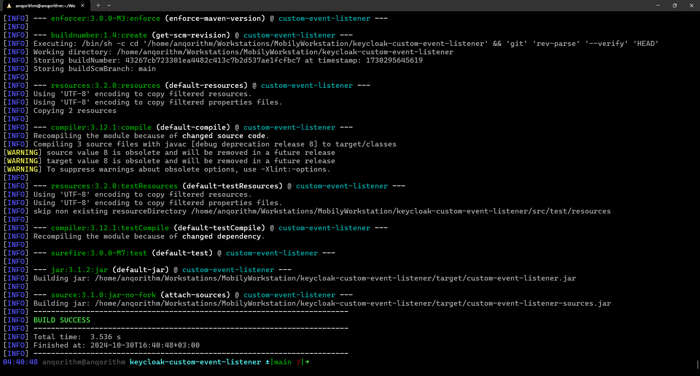


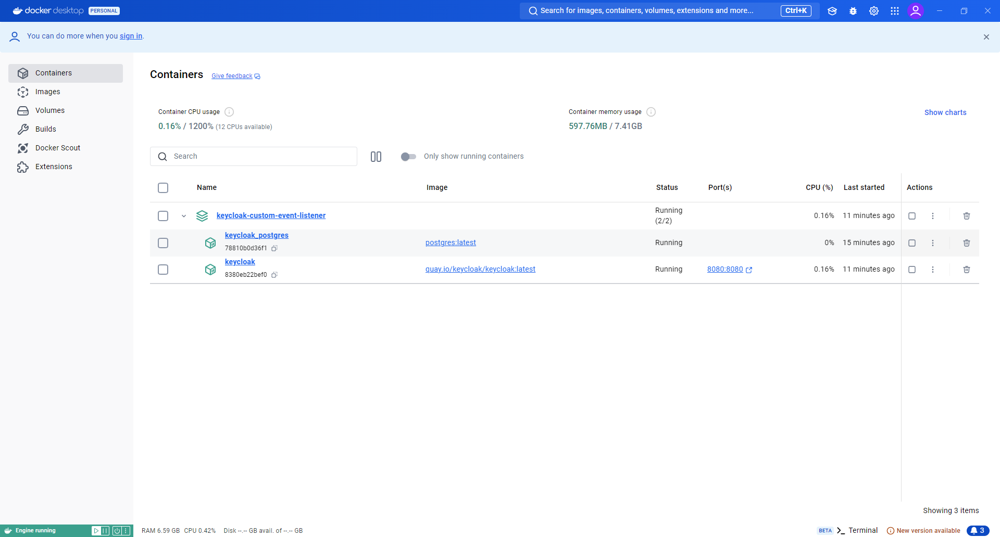

## Detailed Setup Guide

### 1. Installation

#### Clone Repository
```bash
git clone https://github.com/cevher/keycloak-custom-event-listener.git
cd keycloak-custom-event-listener
```

### 2. Configuration

#### Set Up Environment Variables
```bash
# Copy example environment file
cp .env.example .env

# Edit .env file and update the WEBHOOK_URL
# Example:
# WEBHOOK_URL=https://your-webhook-url.com/endpoint
```

### 3. Build and Deploy

#### Build the Extension
```bash
mvn clean package
```

#### Deploy to Keycloak
```bash
# Create providers directory if it doesn't exist
mkdir -p keycloak/providers

# Copy JAR to providers directory
cp target/custom-event-listener.jar keycloak/providers/
```

### 4. Run Keycloak

#### Start Docker Container
```bash
docker-compose up -d
```

### 5. Configure Keycloak

#### Enable Event Listener
1. Access Keycloak Admin Console (default: http://localhost:8080)
2. Login as admin (default credentials: admin/admin)
3. Navigate to:
   - Events
   - Event configs

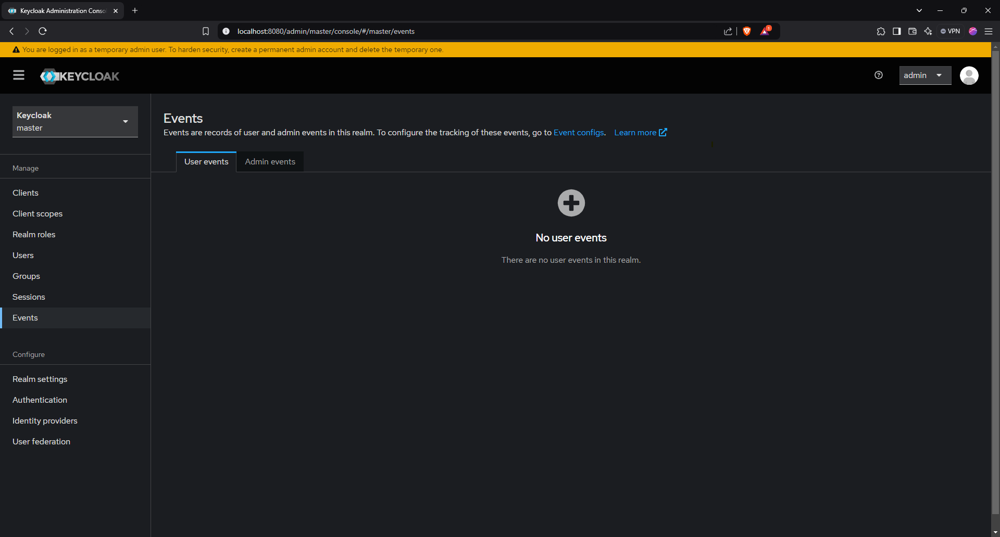

   - Events
   
4. Add "custom-event-listener"

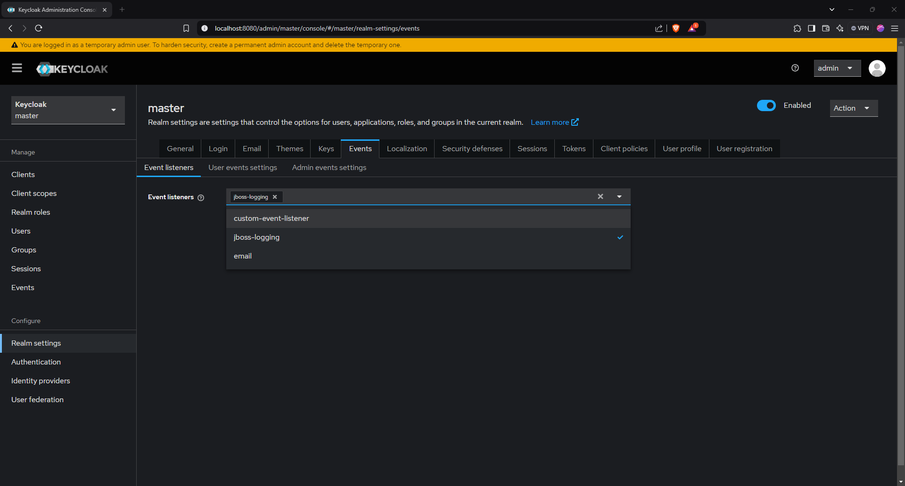

5. Save

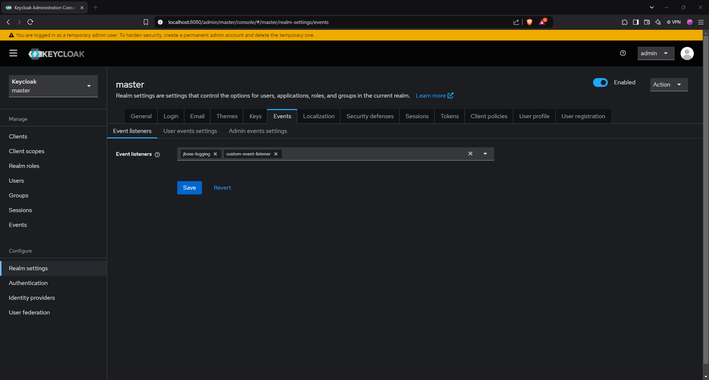

### 6. Configure Webhook

#### Set Up Webhook
1. **Ensure your webhook endpoint is publicly accessible.**

2. **Configure the `WEBHOOK_URL` in the `docker-compose.yaml` file:**
   ```yaml:docker-compose.yaml
   services:
     keycloak:
       image: quay.io/keycloak/keycloak:latest
       environment:
         - WEBHOOK_URL=https://your-webhook-url.com/endpoint
       ports:
         - "8080:8080"
       volumes:
         - ./providers:/opt/keycloak/providers
   ```

3. **Test the webhook by sending a sample event from Keycloak or using a tool like Postman to ensure it receives the data correctly.**

4. **Monitor your webhook endpoint for incoming requests to verify that events are being forwarded successfully.**

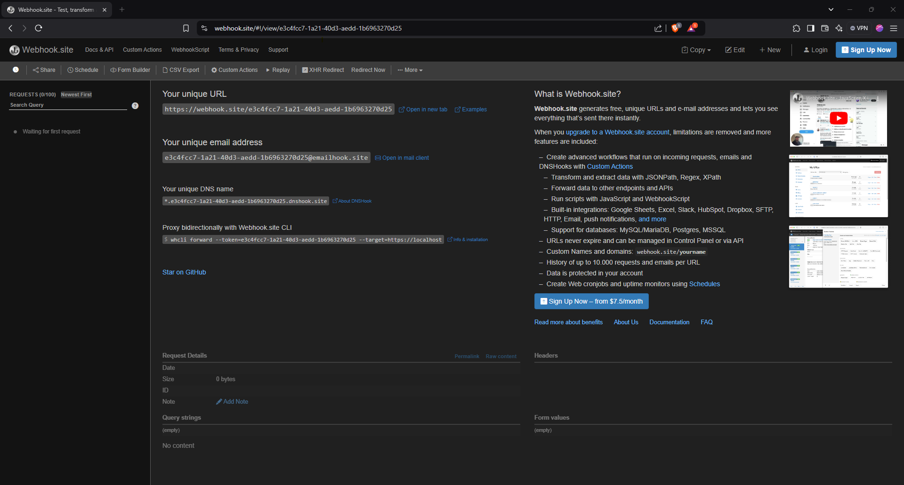

## Usage

### Testing the Integration

#### Method 1: Admin Console
1. Users
2. Add User
3. Fill in the required fields:
   - Username (required)
   - Email
   - First Name
   - Last Name
4. Click "Create" to save the new user

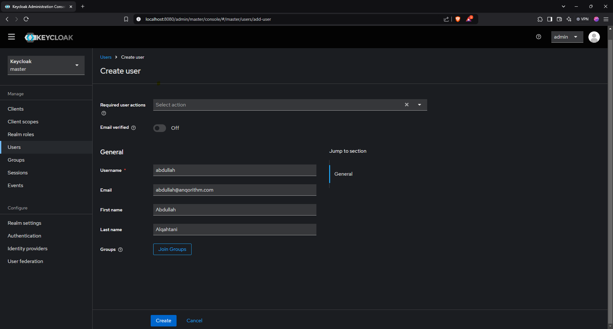

5. Check your webhook endpoint for the notification


#### Method 2: Self-Registration
1. Go to http://localhost:8080/realms/master/account/#/
2. Click "Register" or navigate to the registration page
3. Fill out the registration form and submit

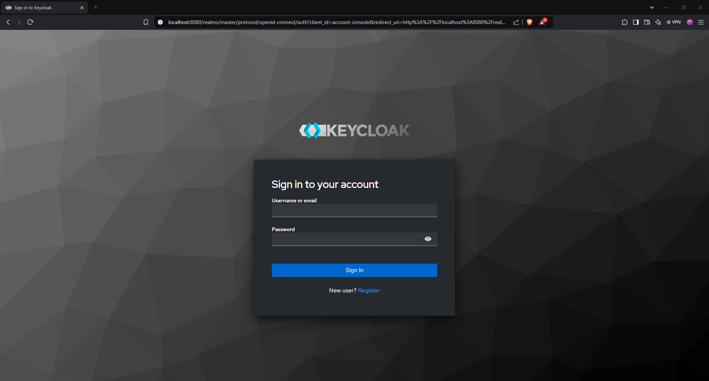

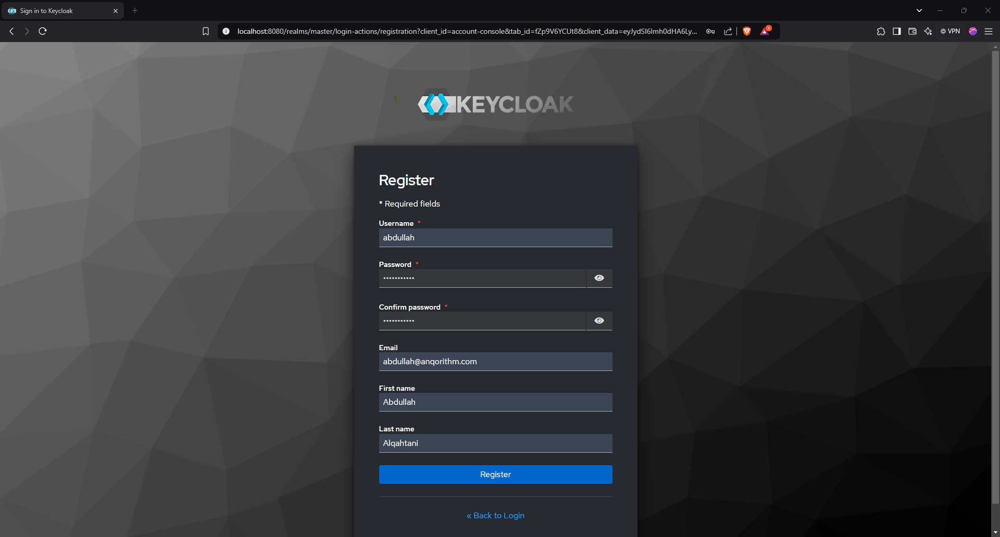

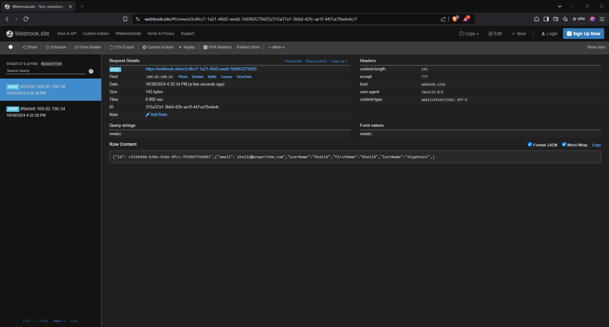

## Architecture
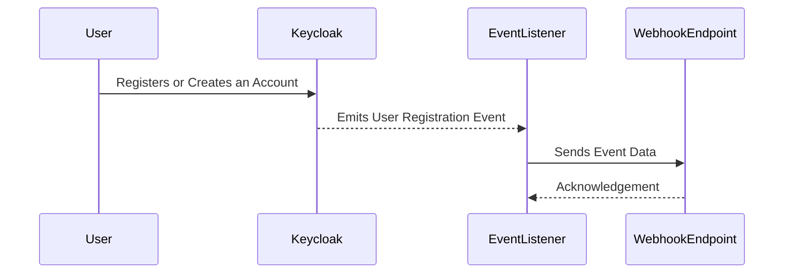

## Development

### Local Testing
You can use services like webhook.site or RequestBin to test the webhook integration:
1. Get a temporary webhook URL from webhook.site
2. Add it to your .env file
3. Create a user in Keycloak
4. Check the webhook.site dashboard for the event data

### Cleanup
```bash
# Stop and remove containers
docker-compose down

# Remove volumes (optional)
docker-compose down -v
```

## Troubleshooting

### Common Issues
1. **Webhook not receiving events**
   - Check if the WEBHOOK_URL in .env is correct
   - Verify the event listener is enabled in Keycloak
   - Check Keycloak logs for any errors

2. **Build failures**
   - Ensure Maven is installed
   - Check Java version (requires Java 11+)

### Logs
```bash
# View Keycloak logs
docker-compose logs -f keycloak
```

## Contributing
Pull requests are welcome! For major changes, please open an issue first to discuss what you would like to change.

## License
[MIT](LICENSE)
