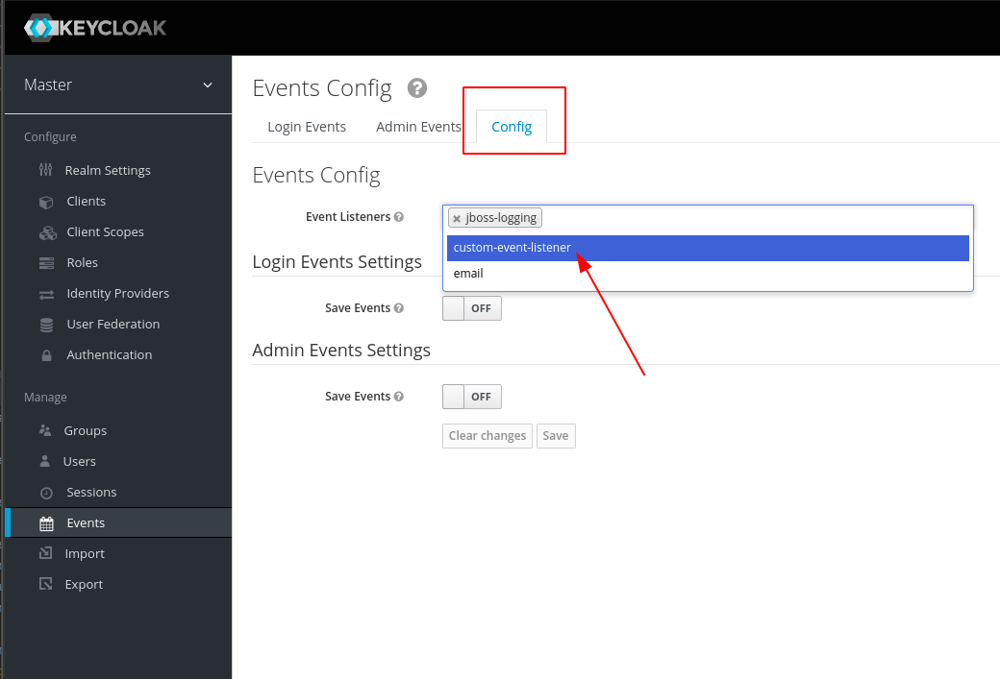
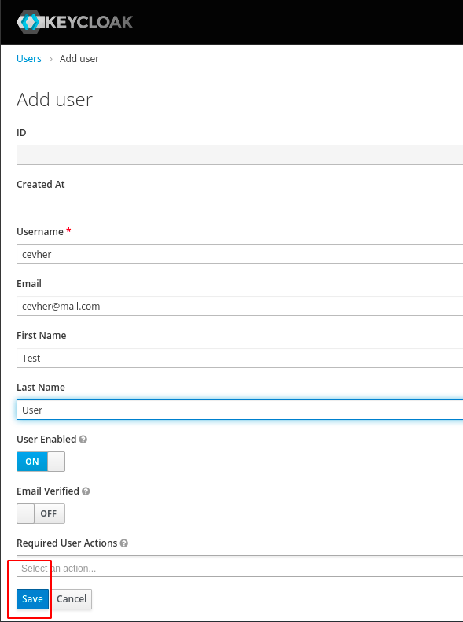
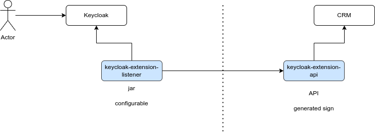
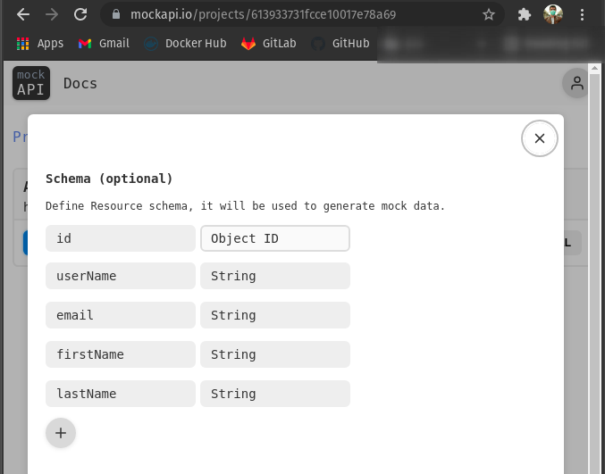
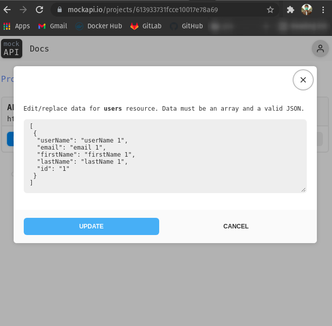

# Keycloak Extension
## Custom Event Listener and API publisher

"User create" and "register" events, listen and Call Rest API with Java


---

### Clone :
```shell
git clone https://github.com/cevheri/keycloak-custom-event-listener

cd keycloak-custom-event-listener
```

---

### Generate JAR:
```shell
mvn clean package
```

---

### Attach keycloak dockerVolume (already in docker-compose file)
```yaml
    volumes:
      - ../../../target/custom-event-listener.jar://opt/jboss/keycloak/standalone/deployments/custom-event-listener.jar
```

---

### Run on Docker:
```shell
docker-compose -f src/main/docker/docker-compose.yml up -d
```

---

### Keycloak Admin Console Configuration :
* Open Keycloak Admin Console
* Login with admin user
* Go to "Events" -> "Config" -> "Config" -> "Event Listeners"
* Add "custom-event-listener" to "Event Listeners"
* Save



---

## Create New User:
* Go to "Users" -> "Add User"
* Fill the form and click "Save"
* Check the API result on MockAPI



---

#### API Design
Hi-Level API Design
* Our motivation is to call an API when a user is created or registered.
* We will use a mock API for this example.



---

### Test Result on MockAPI: 
#### Setup Mock API


---

#### View api result


---

### Stop Docker:
```shell
docker-compose -f src/main/docker/docker-compose.yml down
```

---
